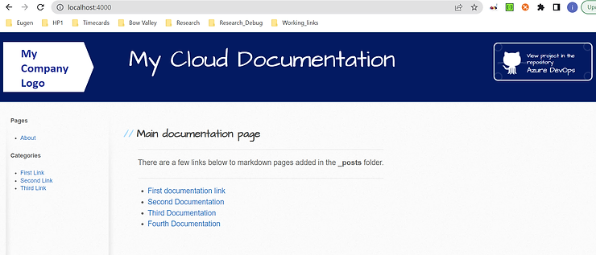

# How to write, build, and deploy professional documentation using markdown 

## Project's description

This article details implementing a centralized documentation website created via the CI/CD integration.

## Online article
Details about this project can be read in my blog's article here: 

[Article](https://www.ideliversoft.com/post/how-to-write-build-and-deploy-professional-documentation-using-markdown)

[Read High Level Design](./Design_Documents/ITS%20Central%20Documentation%20HLD.docx) - from the "./Design_Documents" folder

[Read Low Level Design](./Design_Documents/ITS%20Central%20Documentation%20LLD.docx) - from the "./Design_Documents" folder

## Context
I have done this work in 2022. The main technologies used were: **Ruby**, **Jekyll**, and **Azure CI/CD**.

